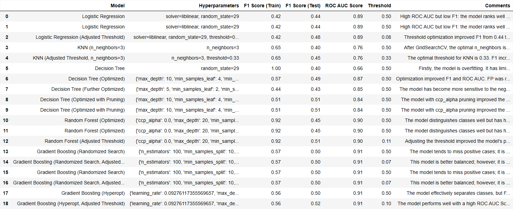

# Bank Term Deposit Prediction

## Project Overview
**bank-term-deposit-prediction** is a project focused on building a machine learning model to predict whether a customer will subscribe to a term deposit at a bank. The project involves performing Exploratory Data Analysis (EDA) and implementing various machine learning models to identify key factors influencing subscription behavior.

## Features
- Comprehensive Exploratory Data Analysis (EDA) with insights into key features.
- Implementation of multiple models, including Logistic Regression, kNN, Decision Trees, Random Forest, and Gradient Boosting.
- Hyperparameter optimization using Grid Search and Bayesian Optimization (`Hyperopt`).
- Decision threshold adjustments to enhance model performance.
- Comparative analysis to identify the best-performing model.

## Project Structure

├── data/
│ ├── processed/ # Processed data after transformations
│ │ └── processed_data.csv
│ └── raw/ # Original raw data files
│ └── bank-full.csv
├── results/ # Model results and performance
│ ├── model_results.csv # CSV file containing model performance metrics
│ ├── model_results.md # Summary of the model results
│ └── model_results.png # Visual representation of model results
├── scripts/ # Script files for data processing and model training
│ ├── pycache/ # Cached files
│ ├── init.py
│ ├── data_processing.py # Script for data preprocessing and feature engineering
│ └── data_training.py # Script for training various models
├── EDA_and_Modeling_Bank_Data.ipynb # Jupyter notebook for EDA and model comparison
├── requirements.txt # List of required dependencies
├── README.md # Project README file
└── .gitignore # Git ignore file

## Getting Started

### Prerequisites
To run this project, you need to have the following libraries installed:
- `numpy`
- `pandas`
- `scikit-learn`
- `matplotlib`
- `seaborn`
- `hyperopt`

Install all dependencies with:
```bash
pip install -r requirements.txt
```

### Installation
1. Clone the repository:
```bash
git clone <https://github.com/AnDeresh/bank-term-deposit-prediction.git>
```

2. Navigate to the project directory:
```bash
cd bank-term-deposit-prediction
```

3. Download the dataset and place it in the `data/raw` folder.

### Running the Project

1. Data Processing:
Run the `data_processing.py` script to preprocess and transform the raw data:
```bash
python scripts/data_processing.py
```

2. Model Training:
Train the machine learning models using:
```bash
python scripts/data_training.py
```

3. Exploratory Analysis and Visualizations:
Open the Jupyter notebook `EDA_and_Modeling_Bank_Data.ipynb` to explore data, visualize results, and compare model performance:
```bash
jupyter notebook EDA_and_Modeling_Bank_Data.ipynb
```

## Results

The best model obtained from the experimentation is the `Gradient Boosting` model with Hyperopt optimization and adjusted threshold:

- F1 Score (Test): `0.52`
- ROC AUC Score: `0.91`
- Top Features:
  - `duration`
  - `poutcome`
  - `previous`

## Model Training Results



[See the full table here](results/model_results.md)

## Visualizations
- Feature importance charts are available in the notebook.
- ROC curves for each model.
- Confusion matrices to evaluate model performance.

## Scripts Overview

### 1. `data_processing.py`
This script focuses on **data analysis** and **preprocessing**. Key functionalities include:
- **Analyzing Columns**: Contains functions such as `analyze_numeric_column` and `analyze_categorical_column` to perform detailed analysis and visualizations for each column type.
- **Target Column Analysis**: `analyze_target_column` provides insights into the distribution of the target variable.
- **Encoding Categorical Variables**: The `encode_categorical_columns` function performs One-Hot Encoding for categorical columns, maps ordinal values for columns like `education` and `month`, and encodes binary columns.
- **Outlier Detection**: `detect_outliers` identifies outliers using either IQR or Z-score methods.
- **Outlier Handling**: `handle_outliers` offers multiple strategies like removing, capping, or filling outliers.

### 2. `data_training.py`
This script is dedicated to **model training** and **evaluation**. It includes:
- **Model Training and Evaluation**: `train_and_evaluate_model` trains the input machine learning model and evaluates it using metrics like F1 Score and ROC AUC. It also includes visualizations such as ROC curves and confusion matrices.
- **Results Table Management**: `update_comments` updates the evaluation table with comments on each model's performance.